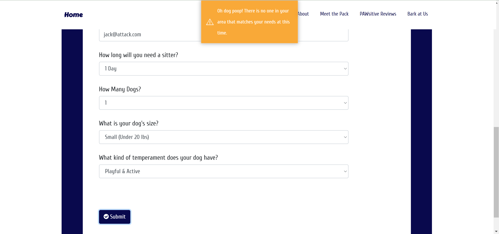

# 🐕 Pet-Swap 🐕
An app used to connect with a pet sitter in your area!

# 📝Description 📝
Pet-Pawtners is an application that helps dog owners meet a sitter that can handle your dog's character traits! As for sitters, this app  allows them to search for a dog or dogs that they can manage to care for based on their experience. The whole point of this application is to get your dog away from being boarded and they go to a home with a sitter who cares! 


The web application is deployed on heroku: https://pet-pawtners.herokuapp.com/. 

The way this website works is by taking the user information that is input by the owner of the dog. The information asked for are name, photo link of dog, city, state, email, duration of stay, size of the dog, number of dogs, and lastly the dog's characteristics. It then stores that information in the database, then finding a pet sitter matches in the sitter database and returning those matches to the screen. 


The front end form post the information to the API route on the back end. The API route will then parse the information into a sequelize object and then using sequelize functions to store the object in the database. Query functions are used to retrieve matches from that same database (MySQL) where if all criteria entered matches whats in the database. It will then return that list of matches as json to the front end. 


The front end in turn will parse the json list and will dynamically generate a HTML list of matches. Basically, turn that code into HTML readable text as seen in the gifs above. 

If no matches were found (an empty list is returned from the API), a Toastr pop-up will inform the user that no suitable matches are available at this time. 



# 💾 Installation 💾	
1.	Fork the repository --> Go ahead and click on the far top right corner and fork it to your GitHub Portfolio 
2.   Clone the repository to your local PC. This way you can make your own edits. 
3.	Update your configuration with your local user name, password, and server ip for mysql, in the development section. This can be found in config.js file.  You can create a .env to hide your information. 
4.	Run `npm i` to install the dependencies. 
5. Create a database in you local MySQL server named PetSwap. 
6. Enter `node server.js` in your terminal to start the program. That will start inserting some seeding records and starts the web application making it available on your localhost port 8080. 

# 🖥️ Deployment on Heroku 🖥️	
* Prerequisite: If you haven't done so yet, create an account on [Heroku](https://signup.heroku.com/login). 
1. Create a web app on Heroku named petswap-(your initials)
2. Once the app is created, it will go to the Deploy tab where you can connect to your GitHub and use the forked app. 
3. I recommend a manual deploy from your master branch. You will then click deploy. You should receive a message stating "build succeeded"
4. Go to your overview and click on "config add ons". 
5. Type in Jaws DB and add that as your config. 
6. Go back into the code and go to your config.js and make sure the production shows the following:
 ```
 "production": {
    "use_env_variable": "JAWSDB_URL",
    "dialect": "mysql"
```
7. You can now open the app through Heroku and test it out!! 


# 🖇️Connecting to Heroku on MySQL 🖇️
1. Open your MySQL WorkBench and set up a new connection. 
2. Go switch over to your web browser and go the Heorku overview page and click on Jaws DB. You will then be redirected to Jaws DB dash board. 
3. Copy the username, host name, and password to the new connection dialogue that popped on your MySQL work bench.  You can rename the connection whatever you'd like. I name it Heroku-PetSwap. 
4. Once you entered the information in, you will now see your connection and you can open it up. 
5. Go the far left to the schema and it will show the data for the application. This will start storing the data that the user submits in the website to MySQL workbench. Perfect way to track and store data coming in and out of your website! 


# ⛓️ Technologies / Dependencies ⛓️	
* 👾  NPM packages:
     - Node
     - Nodemon 
     - Require 
     - Toastr 
     - Sequelize 
     - MySQL2
* 👾  jQuery
* 👾  HTML / CSS / Bootstrap


# 🖊️ Authors 🖊️ 
* 👩‍💻  [Dana Nobile](https://github.com/DanaNobile) 
* 👩‍💻  [Diana Mayhugh](https://github.com/mayhugh82)
* 👨‍💻  [Anthony Carmack](https://github.com/InvNO1247)
* 👨‍💻  [Andy Edstrom](https://github.com/andree15)
* 👩‍💻  [Jacqueline Geiger](https://github.com/jcqlng)
 

# 🔗 Links and Resources 🔗

* 💻	  Assistance with getting the module in node to show an [unorder list](https://developer.mozilla.org/en-US/docs/Web/API/Element/insertAdjacentElement) 

* 💻	 Assistance with [Sequelize](https://sequelize.org/)

* 💻	 Assistance with [Deployment on Heroku](https://youtu.be/btG3SkoNOLU?list=PLOFmg4xbN_TPrB6w4rThsFanVxJI_SfER).

* 💻	 Deploying with [Heroku & Sequelize](https://sequelize.readthedocs.io/en/1.7.0/articles/heroku/)

* 💻    Using the [Sequelize Sync Function](https://medium.com/@smallbee/how-to-use-sequelize-sync-without-difficulties-4645a8d96841) 

* 💻      Creating [API setups](https://medium.com/@avanthikameenakshi/building-restful-api-with-nodejs-and-mysql-in-10-min-ff740043d4be)

